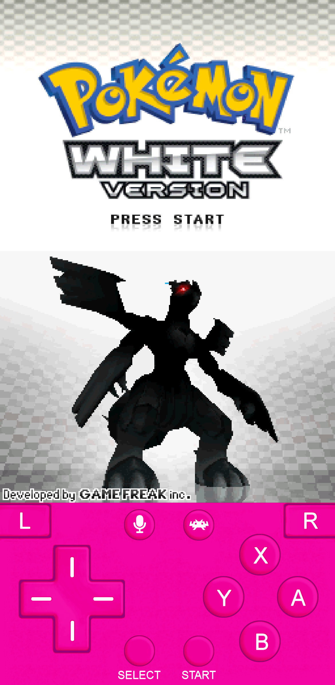
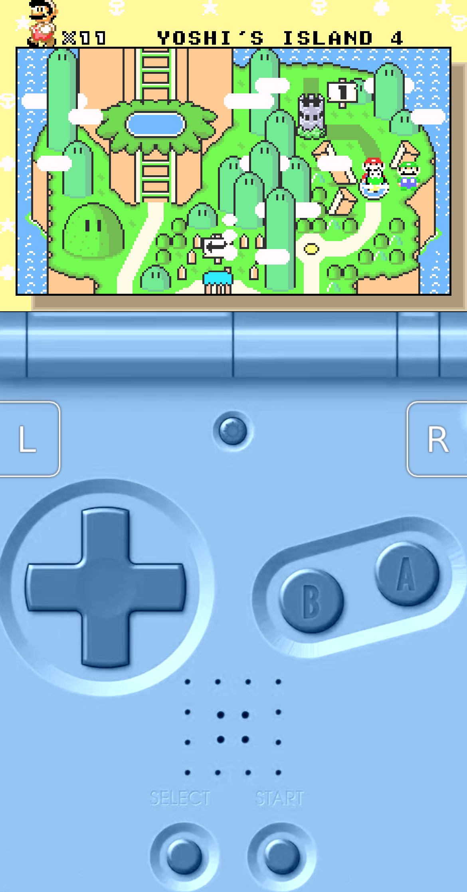

# Oshanotter's RetroArch Overlays
This repository contains several overlays and gamepads for the retro emulation app RetroArch.

## Examples
- [Nintendo DS Overlay](#Nintendo-DS-Overlay)
- [Game Boy Advance SP Overlay](#Game-Boy-Advance-SP-Overlay)

## Nintendo DS Overlay
An overlay for the Nintendo DS meant to be used in portrait mode on a touch screen device. 
Go to its [Page](./nds/README.md) for more details. 

|  |  |
|:---:|:---:|

## Game Boy Advance SP Overlay
An overlay for the Nintendo Game Boy Advance SP meant to be used in portrait mode on a touch screen device. 
Go to its [Page](./gba_sp/README.md) for more details.

|  |  |
|:---:|:---:|
