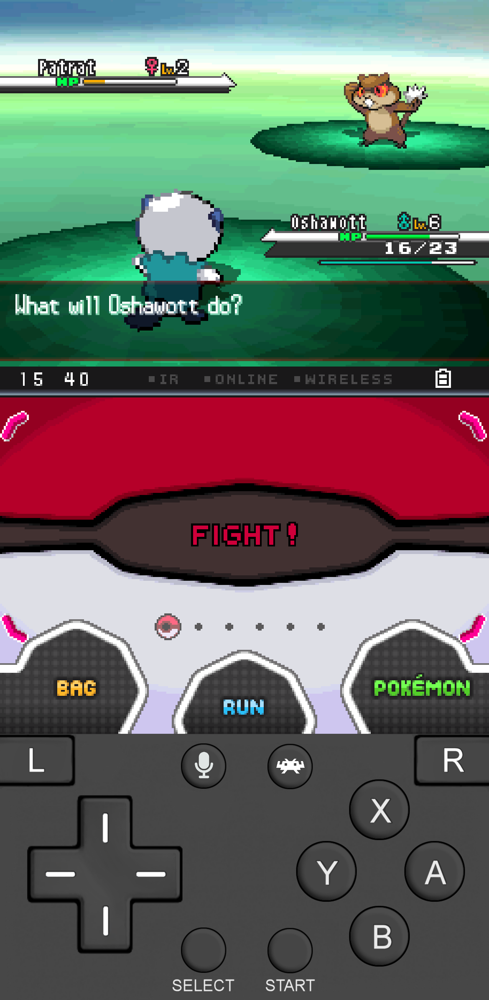
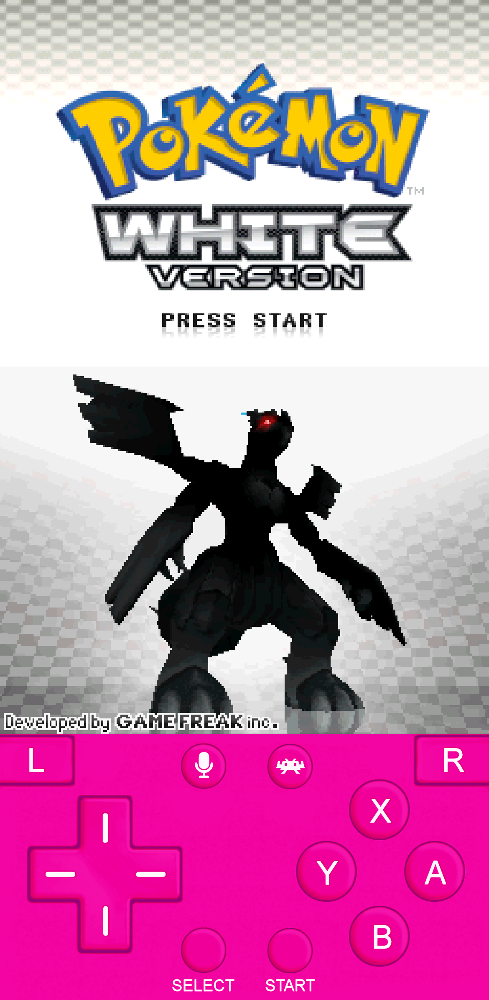

# Nintendo DS Overlay

An overlay for the Nintendo DS meant to be used in portrait mode on a touch screen device.

There are several different color options, including blue, gray, green, orange, pink, purple, red, teal, and yellow!
Below are two examples of how the gamepad overlay will look.

|Gray|Pink|
|:---:|:---:|
|  |  |

## Download
Click the button below to download this overlay.

<kbd>   [Download](https://github.com/Oshanotter/RetroArch-Overlays/releases/download/nds/nds.zip)   </kbd>

## How To Install
> [!NOTE]  
> This has currently only been tested on an iPhone 12 with the following settings, however it should work with other touch screen devices with little to no modification.
1. Download the zip file linked above and extract it.

2. Place it somewhere in your RetroArch folder.
I would recommend placing it in the following location: **RetroArch > overlays > gamepads**

3. Open RetroArch and start playing a game with the core that you want. Then open the RetroArch Quick Menu.

4. Once in the Quick Menu, tap on "On-Screen Overlay" then "Overlay Preset". Navigate to the overlay that you want and select it.

> [!IMPORTANT]
> For this overlay to display properly, follow these extra steps. Back in the "On-Screen Overlay" menu, turn off "Auto-Scale Overlay".

5. Finally, back in the Quick Menu, tap on "Overrides" then tap "Save Core Overrides".

That's it! Enjoy using your new overlay!
